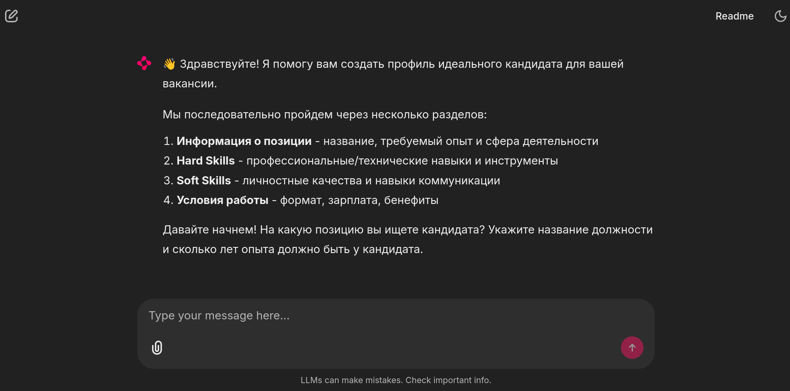

# AI HR Assistant

Chainlit-based conversational AI for creating structured candidate profiles.

## Demo



## Installation

```bash
# Install dependencies
uv sync

# Setup environment
cp .env.example .env
# Edit .env with your OPENAI_API_KEY

# Start PostgreSQL
docker-compose up -d

# Install pre-commit hooks
uv sync --group quality
uv run pre-commit install
```

## Usage

```bash
# Run the application
chainlit run app.py

# Run with uv
uv run chainlit run app.py
```

Open http://localhost:8000 and follow the guided conversation to create candidate profiles.

## Development

### Code Quality

```bash
# Run all quality checks
uv run ruff check src/ --fix
uv run mypy --ignore-missing-imports --follow-imports=silent src/
uv run bandit --severity-level high --confidence-level high --skip B101 -r src/

# Format code
uv run ruff format src/
```

### Committing

Pre-commit hooks run automatically. To commit:

```bash
git add .
git commit -m "your commit message"
```

If hooks fail, fix the issues and commit again.

## Requirements

- Python ≥3.12
- PostgreSQL
- OpenAI API key
